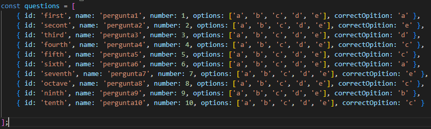
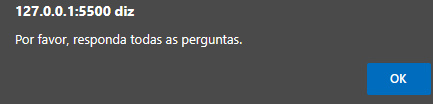
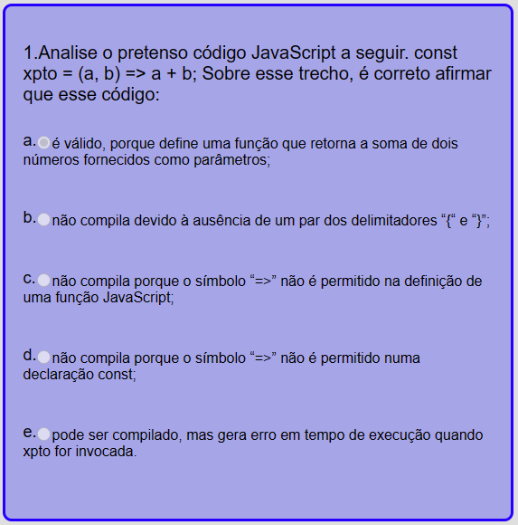
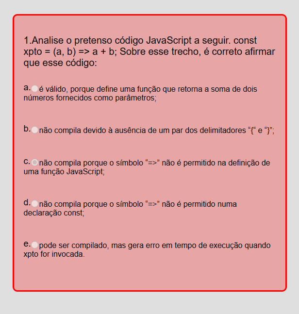
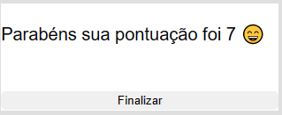
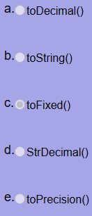

<h1>Avaliação</h1>
<h2><li>Sobre o código</li></h2>

O código começa armazenando uma lista de perguntas para uma avaliação. Cada pergunta é representada como um objeto dentro da matriz questions, com várias propriedades, como id, name, number, options e correctOpition. A função desse código é fornecer uma estrutura de dados para armazenar as perguntas e suas respectivas opções de resposta, além de indicar qual é a opção correta para cada pergunta.

Foi criado seis variáveis  
<li><strong>let score:</strong> Para junto com uma estrutura de repetição, somar as questões certas.</li>  
<li><strong>let allAnswered:</strong> Para verificar se todas as quetões estão respondida, se não estiver acionar um alerta, se estiver  usar uma estrutura de repetição para veificar quais estão corretas, adicionar uma class do CSS e adicionado valor para váriavel score.</li>

<li><strong>CERTA</strong></li>

<li><strong>ERRADA</strong></li>

 
<li><strong>let result:</strong> Apenas para mostrar na tela do usuário a sua nota </li>  

<li><strong>const check:</strong> Para capturar os checkbox e impossibilitar que ele seja marcado após o final da avaliação </li> 

